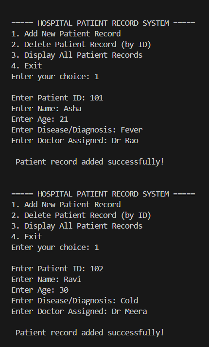
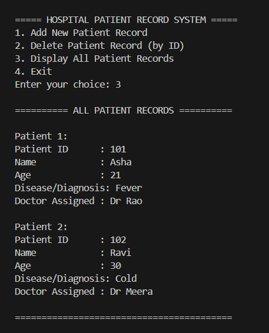
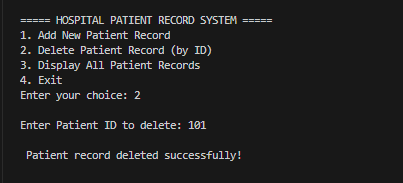
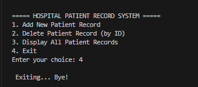

Problems based on Structures

# Hospital Patient Records Management System (Structures in C)

## Problem Statement

Design and implement a C program using **Structures** to maintain **patient records in a hospital system**.

Each patient record contains:
- Patient ID
- Name
- Age
- Disease

The system allows storing and managing patient information efficiently using structures.

---

## Operations Implemented

1. **Add Patient**
   Adds a new patient record to the system.

2. **Display All Patients**
   Displays the list of all patient records stored in the system.

3. **Delete Patient**
   Removes a patient record using the Patient ID.

4. **Exit**
   Terminates the program.

---

## Data Structure Used

Structure (struct)

Each patient is represented using a structure containing:
- ID
- Name
- Age
- Disease

Records are stored using an array of structures.

---

## How to Run

Compile the program:

```
gcc patient_records.c -o patient_records.exe
```

Run the program:

```
.\patient_records.exe
```

---

## Sample Output







