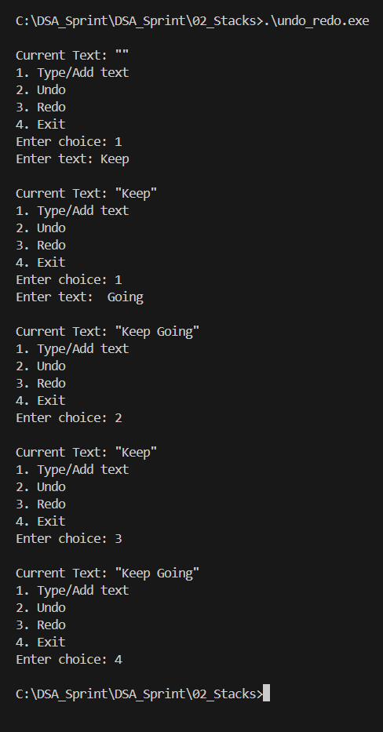

Problems based on Stacks

# Undo Redo Text Editor (Stack in C)

## Problem Statement

In a text editor, users often perform operations such as typing, deleting, or modifying text.

To improve user convenience, the editor provides **Undo and Redo functionalities**.

This project simulates a **Text Editor Undo/Redo system using Stack Data Structure in C**.

---

## Operations Implemented

1. **Insert Operation**
   Adds a new editing action to the stack.

2. **Undo Operation**
   Removes the most recent operation from the Undo stack and moves it to the Redo stack.

3. **Redo Operation**
   Reapplies the most recently undone operation.

4. **Display Current Text**
   Shows the current state of the text after operations.

5. **Exit**
   Terminates the program.

---

## Data Structure Used

Stack

Two stacks are used:
- **Undo Stack**
- **Redo Stack**

Stack follows the **LIFO principle (Last In First Out)**.

---

## How to Run

Compile the program:

```
gcc undo_redo.c -o undo_redo.exe
```

Run the program:

```
.\undo_redo.exe
```

---

## Sample Output

