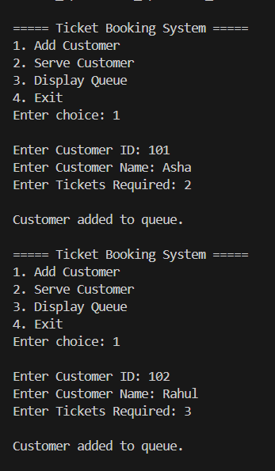
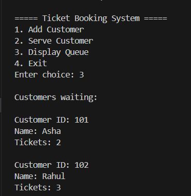
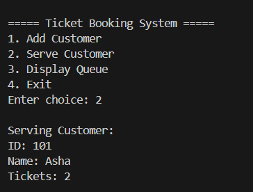
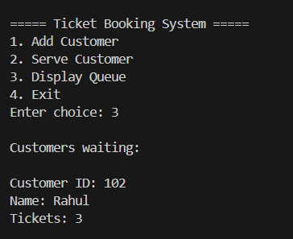

Problems based on Queues
# Ticket Booking System (Queue in C)

## Problem Statement
In a ticket counter (for movies, trains, or events), customers arrive and wait for their turn to book tickets.  
The system serves customers in the order they arrive (FIFO - First In, First Out).

This project simulates a **Ticket Booking System using a Queue in C**.

Each customer has:
- Customer ID
- Name
- Number of Tickets Required

---

## Operations Implemented

1. **Add Customer (Enqueue)**  
   Adds a new customer to the queue.

2. **Serve Customer (Dequeue)**  
   The first customer in the queue books the ticket and leaves.

3. **Display Queue**  
   Displays all customers currently waiting in the queue.

4. **Exit**  
   Terminates the program.

---

## Data Structure Used
Queue (Array Implementation)

FIFO Principle:  
**First customer to enter the queue will be served first.**

---

## How to Run

Compile the program:

gcc ticket_booking.c -o ticket_booking.exe

Run the program:

.\ticket_booking.exe

---

## Sample Output

