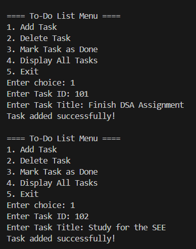
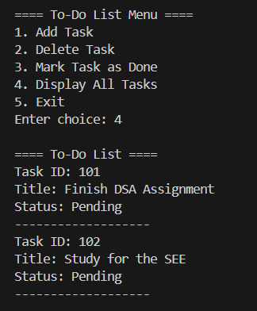
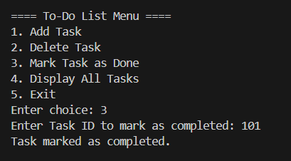
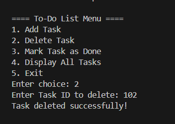
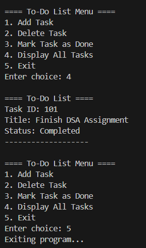

Problems based on Linked Lists
# To-Do List Application (Linked List in C)

## Problem Statement
A to-do list is used to manage daily tasks efficiently. Each task has a title and a status (Pending or Completed).

This project simulates a **To-Do List Application using a Singly Linked List in C**.

Each task contains:
- Task ID
- Task Title
- Status (Pending / Completed)

---

## Operations Implemented

1. **Add Task**  
   Adds a new task to the list.

2. **Delete Task**  
   Removes a task using its Task ID.

3. **Mark Task as Done**  
   Updates the status of a task to "Completed".

4. **Display All Tasks**  
   Displays all tasks currently in the list.

5. **Exit**  
   Terminates the program.

---

## Data Structure Used
Singly Linked List

Each node stores task details and a pointer to the next task.

---

## How to Run

Compile the program:

gcc todo_list.c -o todo_list.exe

Run the program:

.\todo_list.exe

---

## Sample Output

