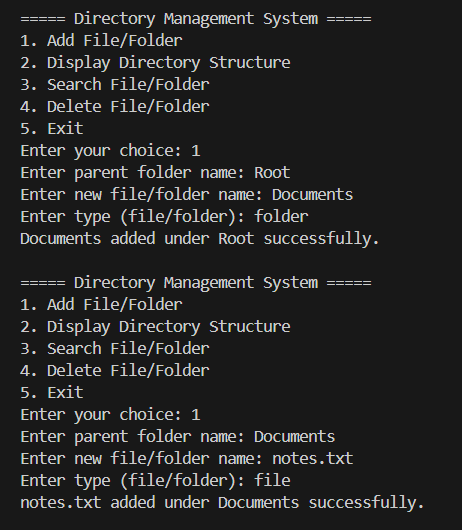
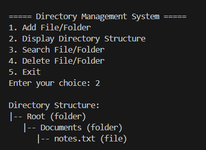
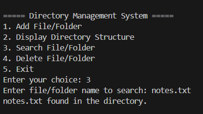
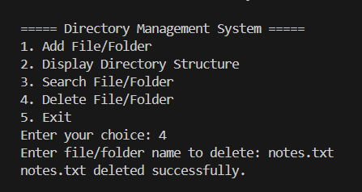
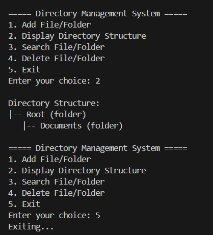

Problems based on Trees

# Directory Management System (Tree in C)

## Problem Statement
Design and implement a C program using a Tree Data Structure to represent a computer file system.

Each node represents either a **folder** or a **file**, forming a hierarchical structure similar to operating systems like Windows or Linux.

Each node contains:
- File/Folder Name
- Type (file or folder)
- Child Nodes

---

## Operations Implemented

1. **Add File/Folder**
   Adds a new file or folder under an existing directory.

2. **Display Directory Structure**
   Displays the directory hierarchy.

3. **Search File/Folder**
   Searches for a file or folder by name.

4. **Delete File/Folder**
   Deletes a file or folder node.

5. **Exit**
   Terminates the program.

---

## Data Structure Used
Tree Data Structure

Each node can have multiple children representing files or folders.

---

## How to Run

Compile the program:

gcc directory_management.c -o directory_management.exe

Run the program:

.\directory_management.exe

---

## Sample Output

