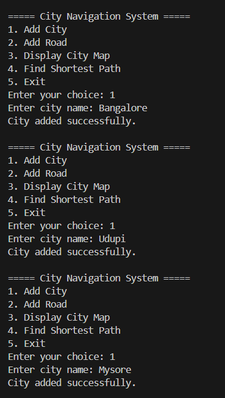
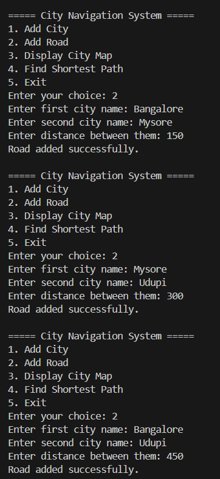
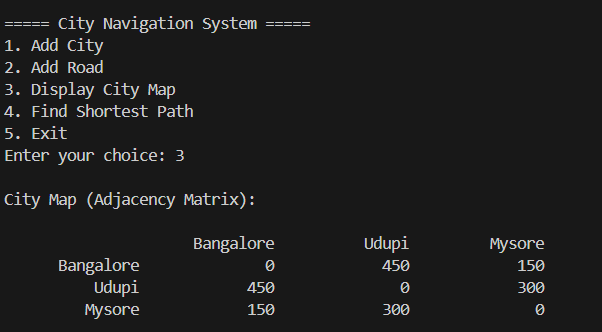
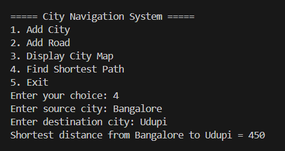
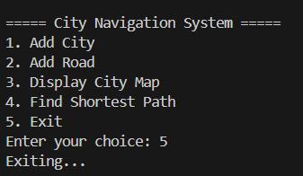

Problems based on Graphs

# City Navigation System (Graph in C)

## Problem Statement

Design and implement a C program using a **Graph Data Structure** to represent a map of cities and roads between them.

Each **vertex represents a city**, and each **edge represents a road** with a certain distance (weight).

This project simulates a **City Navigation System using a Graph in C**, similar to how GPS systems like Google Maps find routes.

Each city is connected by roads with distances.

---

## Operations Implemented

1. **Add City**  
   Adds a new city (vertex) to the graph.

2. **Add Road (Edge)**  
   Connects two cities with a road and assigns a distance.

3. **Display City Map**  
   Displays the city connections using an **Adjacency Matrix**.

4. **Find Shortest Path**  
   Uses **Dijkstra’s Algorithm** to find the shortest distance between two cities.

5. **Exit**  
   Terminates the program.

---

## Data Structure Used

Graph (Adjacency Matrix Representation)

Vertices = Cities  
Edges = Roads between cities  
Weights = Distance between cities

Shortest path is calculated using **Dijkstra’s Algorithm**.

---

## How to Run

Compile the program:

```
gcc city_navigation.c -o city_navigation.exe
```

Run the program:

```
.\city_navigation.exe
```

---

## Sample Output









