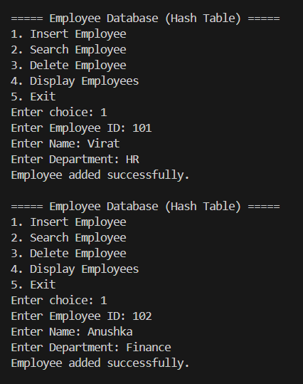
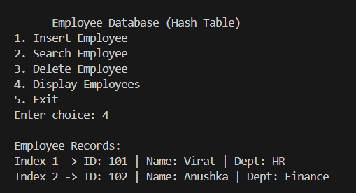
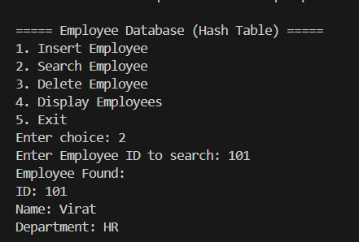
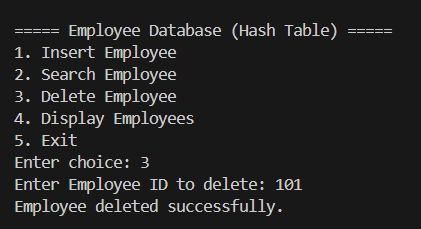
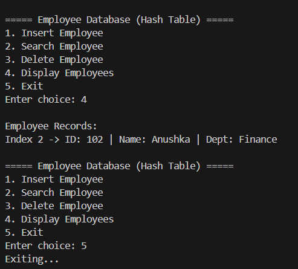

Problems based on Hashing

# Employee Database (Hash Table in C)

## Problem Statement

Implement a C program using **Hashing** to maintain an **Employee Database**.

Each employee record contains:
- Employee ID (Key)
- Name
- Department

A **hash function** is used to determine the storage index and **handle collisions using Linear Probing**.

---

## Operations Implemented

1. **Insert Employee**
   Adds a new employee record into the hash table.

2. **Search Employee**
   Searches for an employee using their Employee ID.

3. **Delete Employee**
   Removes an employee record from the database.

4. **Display Employees**
   Displays all employee records stored in the hash table.

5. **Exit**
   Terminates the program.

---

## Data Structure Used

Hash Table (Array Implementation)

Collision handling method: **Linear Probing**

Hash function used:

```
index = employee_id % table_size
```

---

## How to Run

Compile the program:

```
gcc employee_hash.c -o employee_hash.exe
```

Run the program:

```
.\employee_hash.exe
```

---

## Sample Output









